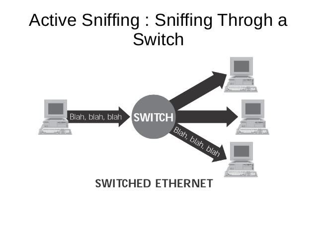

**Resume Pertemuan 4 Sisitem Keamanan Jaringan**

 
 
 

 

Latar Belakang Masalah

Pada jaman yang modern ini banyak yang bisa dilakukan jika kita terhubung pada suatu jaringan internet, karena dengan menggunakan internet kita dapat dengan mudah mengakses apa yang kita butuhkan. Tetapi dalam penggunaan internet banyak yang menggunakannya dengan tidak baik sehingga bisa saja merugikan orang lain seperti melakukan proses Sniffing.

1. Apa itu Sniffing?
2. Apa metode Sniffing?
3. Apa saja contoh tools yang dapat digunakan dalam Sniffing?
4. Bagaimana contoh dalam melakukan Sniffing?
5. Bagaimana yang harus dilakukan agar terhindar oleh penggunakan proses Sniffing?

Sniffing merupakan praktek membaca paket IP dari node 1 ke lain nya atau kegian untuk menghitung paket data pada jaringan.

Metode yang digunakan melakukan intercepting jaringan/ masuk ke jalur dimana paket melalui jalan itu sendiri.

Contoh tools yang dapat digunakan dalam Sniffing adalah Wireshack, TCP Dump, Socket Python dll.

Contoh yang melakukan Sniffing adalah

1. jaraingan wifi kampus ada leptop dosen dan ada leptop mahasiswa dosen tergabung dalam 1 akses poin.
2. mahasiswa melakukan sniffing di laptop.
3. dosen login hostport itu artinya dosen menaruh paket dijaringan wifi berupa user, password di form HTML metode post.
4. sniffer di leptop mahasiswa manangkap data tsb.
5. mahasiswa memakai user untuk login hostport menggunakan akun dosen.

Untuk menghindari penggunaan Sniffing oleh orang lain terhadap kita

1. Ubah HTTP menjadi HTTPS.
2. Gunakan enkripsi AES/ yang lebih tinggi pada enkripsi si HTTPS.

Penutup

Kesimpulan

Dapat disimpulkan bahwa penggunaan Sniffing mudah dilakukan dengan program sniffer yang tersedia, tetapi jika kita tidak teliti dalam menggunakannya dapat merugikan orang lain karena proses Sniffing ini dapat membaca data yang kita miliki seperti username dan password.

Saran

Saran saya sebaiknya kita mempelajari Sniffing dengan lebih lagi, karena menggunakan proses Sniffing untuk hal – hal yang tidak diperlukan agar tidak merugikan orang lain

- Nama : Entol Achmad Fikry Ilhamy
- NPM : 1144115
- Kelas : 3C
- Prodi : D4 Teknik Informatika
- Mata Kuliah : Sistem Keamanan Jaringan

Link Github :  [https://github.com/enfikry25/SistemKeamananJaringan](https://github.com/enfikry25/SistemKeamananJaringan)

Referensi :

1. [https://rodcysky.wordpress.com/2009/10/12/apa-itu-network-sniffing/](https://rodcysky.wordpress.com/2009/10/12/apa-itu-network-sniffing/)
2. [https://id.wikipedia.org/wiki/Enkripsi](https://id.wikipedia.org/wiki/Enkripsi)

Scan Plagiarisme

1. smallseotools - Link  [https://drive.google.com/open?id=0B84lVJ2VqAfRaTFqbnJEeUhseEk](https://drive.google.com/open?id=0B84lVJ2VqAfRaTFqbnJEeUhseEk)
2. searchenginereports - Link  [https://drive.google.com/open?id=0B84lVJ2VqAfRYkktek14dHdHVTg](https://drive.google.com/open?id=0B84lVJ2VqAfRYkktek14dHdHVTg)