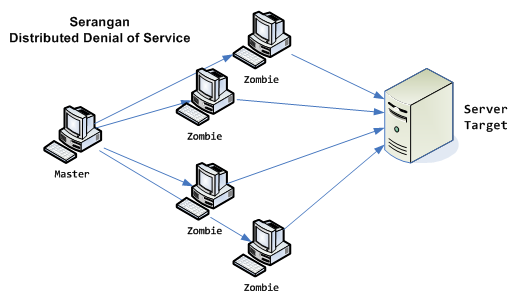

**Resume Pertemuan 6 Sistem Keamanan Jaringan**

 
 
 

 

Latar Belakang Masalah

Di zaman yang modern ini banyak cara yang dilakukan oleh hacker untuk merusak ataupun membuat sistem tidak berjalan dengan baik, tetapi jika seorang hacker sudah tidak ada cara lain maka ada satu cara terakhir yang dapat dilakukan yaitu Denial Of Service atau biasa disebut DOS

1. Apa itu Denial Of Service (DOS)?
2. Bagaimana cara mencegah DOS/DDOS?

1. **Pengertian Denial Of Service**

Denial Of Service (DOS) adalah sebuah insiden di mana seorang pengguna atau organisasi dirampas jasa sumber daya mereka biasanya akan berharap untuk memiliki. Dalam layanan denial-of-didistribusikan, sejumllah besar sistem dikompromikan (kadang-kadang disebut botnet) menyerang satu target

1. **Cara Mencegah DOS/DDOS**

Cara melakukan pencegahan DOS/DDOS belum ada karena kita berada pada sistem client server. Tapi ada cara untuk meringankan sedikit terhidar dari DOS dan DDOS yaitu, Menaikan kapasitas layanan jika penyerang tidak menaikkan kapasitas permintaan, Memblok IP penyerang di firewall, Masukkan semua IP penyerang ke firewall dan Membuat Honey Pot(membuat program dan di-coding)

Penutup

Kesimpulan

Dapat disimpulkan DOS adalah suatu cara seorang hacker untuk membuat serer dengan mengiriimkan banyak permintaan sampai server tidak bisa melayani lagi.

Saran

Kita harus membuat solusi untuk mengatasi DOS dan DDOS karena saat ini belum ada cara untuk menangani atau mencegah sistem DOS dan DDOS

- Nama : Entol Achmad Fikry Ilhamy
- NPM : 1144115
- Kelas : 3C
- Prodi : D4 Teknik Informatika
- Mata Kuliah : Sistem Keamanan Jaringan

Link Github :  [https://github.com/enfikry25/SistemKeamananJaringan](https://github.com/enfikry25/SistemKeamananJaringan)

Referensi :

1. [https://id.wikipedia.org/wiki/Serangan\_DoS](https://id.wikipedia.org/wiki/Serangan_DoS)

Scan Plagiarisme

1. smallseotools - Link  [https://drive.google.com/open?id=0B84lVJ2VqAfRZVk1ZDg4TzMxXzQ](https://drive.google.com/open?id=0B84lVJ2VqAfRZVk1ZDg4TzMxXzQ)
2. searchenginereports - Link  [https://drive.google.com/open?id=0B84lVJ2VqAfROFVVbzBQb2RwYW8](https://drive.google.com/open?id=0B84lVJ2VqAfROFVVbzBQb2RwYW8)