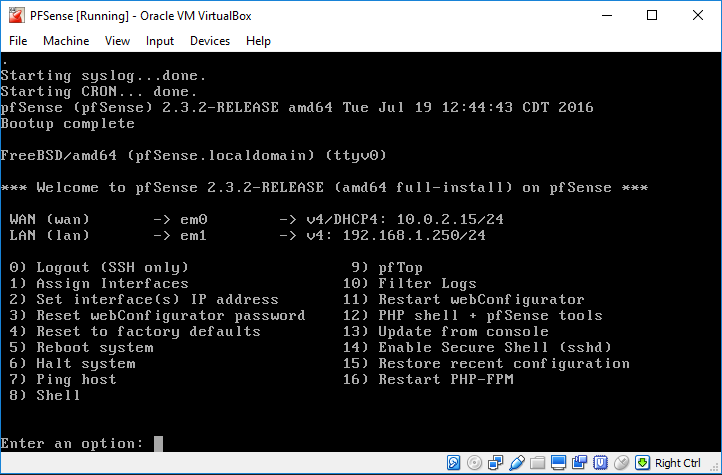
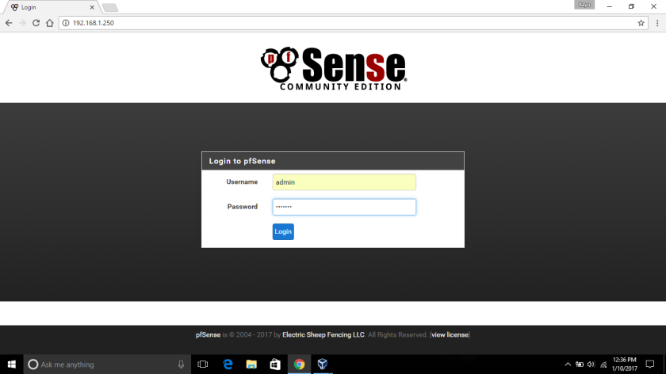
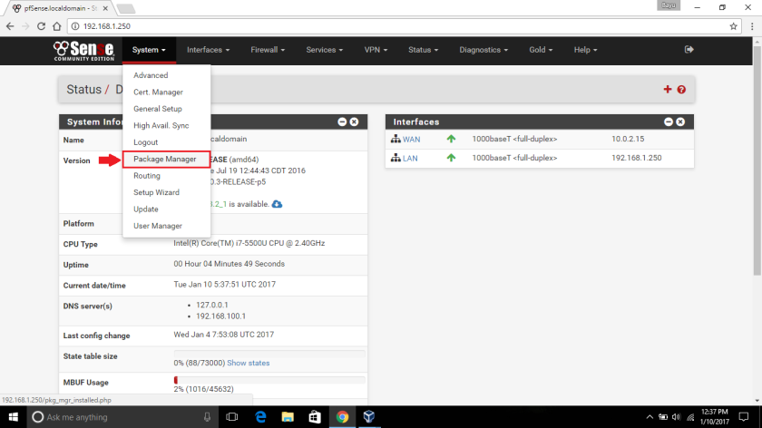
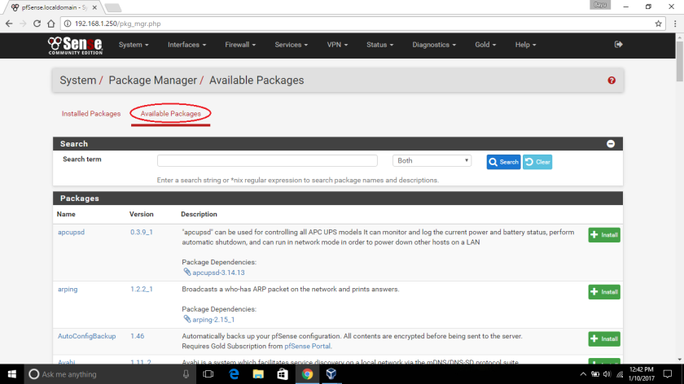
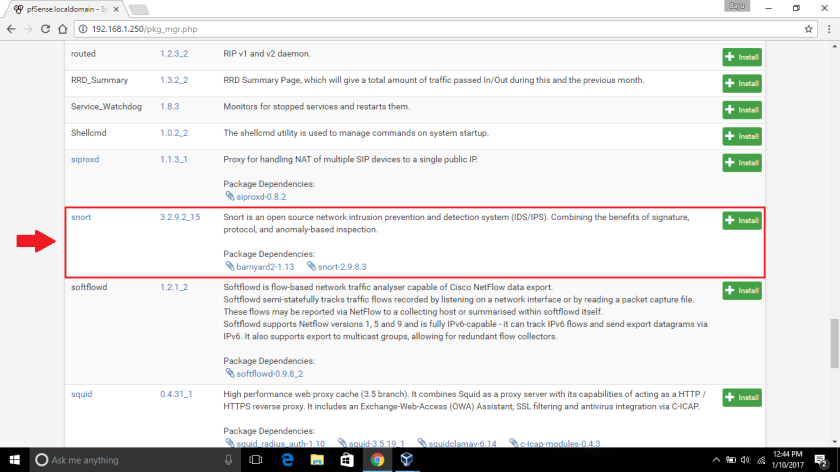
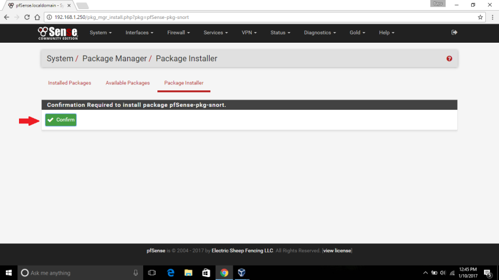
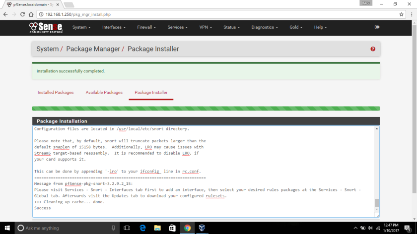
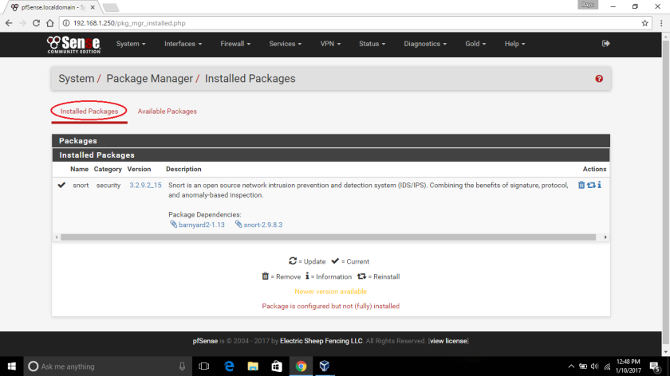

##Latar Belakang Masalah : 
1.	Intrusion Detection System (IDS)
2.	Host Based IDS (HIDS)
3.	Network Based IDS (NIDS)
4.	Intrusion Prevention System (IPS)
5.	Cara Instalasi Snort Pada PFSense

##Intrusion Detection System (IDS) 
Intrusion Detectiion System (IDS) adalah sistem yang memonitor lalu lintas jaringan dan memonitor aktiviitas yang mencurigakan pada suatu jaringan. Jadi, setiap packet yang melalui jaringan akan diperiksa terlebih dahulu, jika terdapat ancaman pada packet maka IDS akan mengeluarkan alert ancaman untuk memberitahu administrator jaringan, jika tidak terdapat ancaman maka packet dianggap normal. Berdasarkan penempatannya, IDS dibagi menjadi 2 jenis, yaitu Host Based Intrusion Detection System (HIDS) dan Network Based Intrusion Detection System (NIDS). IDS juga mempunyai 2 metode yaitu Signature Based dan Anomaly Based.

##Host Based IDS (HIDS) 
Host Intrusion Detection System (HIDS) dijalankan pada host individual atau perangkat pada jaringan. HIDS memonitor paket inbound dan outbound dari perangkat saja dan akan memberitahukan peengguna atau admiinistrator aktivitas mencurigakan yang terdeteksi. Contoh HIDS :
*	OSSEC – Open Source Host-based Intrusion Detection System
*	Tripwire
*	AIDE – Advanced Intrusion Detection Environment
*	Prelude Hybrid IDS

##Network Based IDS (NIDS) 
Network Intrusion Detection System (NIDS) ditempatkan pada titik strategis atau titik dalam jaringan untuk memoniitor lalu lintas semua perangkat pada jaringan. IDS akan memindai semua lalu lintas inbound dan outbound, namun hal itu dapat membuat hambatan yang akan merusak kecepatan seluruh jaringan. Contoh NIDS :
 
##Intrusion Prevention System (IPS) 
Intrusion Prevention System (IPS) adalah sistem yang memonitor jaringan dari kegiatan berbahaya seperti ancamaan keamanan atau pelanggaran kebijakan. Fungsi utama dari IPS adalah untuk mengidentifikasi aktivitas yang mencurigakan, dan kemudian membuat log informasi, mencoba untuk memblokir aktivitas, dan melaporkan aktivitas tersebut. IPS juga bisa disebut IDS yang memiliki kemampuan firewall.

##Cara Instalasi Snort Pada PFSense
Langkah pertama jalankan pfSense pada virtualbox.

Kemudian buka pfSense pada browser dengan memasukkan IP Address LAN yang sesuai dengan virtualbox misalkan http://192.168.1.250, lalu masukkan username dan passwordnya.

 
Kemudian setelah masuk ke halaman utama pilih menu System, lalu pilih Package Manager.

Kemudian pada halaman Package Manager, pilih Available Packages.

 

Kemudian cari snort dan klik Install.

Kemudian klik Confirm untuk mengonfirmasi instalasi snort.

Kemudian tunggu proses instalasi sampai sukses.

 

Setelah itu lihat pada Installed Package, dan snort telah diinstal.

##Kesimpulan
Jadi, Intrusiion Detection System (IDS) adalah sistem yang memonitor lalu lintas jaringan dan memonitor aktiivitas yang mencurigakan pada suatu jaringan. Berdasarkan penempatannya, IDS dibagi menjadi 2 jenis, yaitu Host Based Intrusion Detection System (HIDS) dan Network Based Intrusion Detection System (NIDS). IDS juga mempunyai 2 metode yaitu Signature Based dan Anomaly Based.

##Saran
Untuk memaahami lebih jelasnya alangkah lebih baiknya jika kita mencari di buku-buku yang terpercaya atau melakukan praktikum mandiri.
 
*	Nama : Entol Achmad Fikry Ilhamy
*	NPM : 1144115
*	Kelas : 3C
*	Prodi : D4 Teknik Informatika
*	Kampus : Politeknik Pos Indonesia

Link Matakuliah : http://kampus.awangga.net/assignments/keamananjaringan2016

Link Github : https://github.com/enfikry25/SistemKeamananJaringan

Referensi :
*	 https://id.wikipedia.org/wiki/Sistem_deteksi_intrusi

Scan Plagiarisme :
*	https://drive.google.com/open?id=0B5FSMUsdCMU4Nk5KajE0bkozVkE
*	https://drive.google.com/open?id=0B5FSMUsdCMU4T1d2elFLeFZSTk0