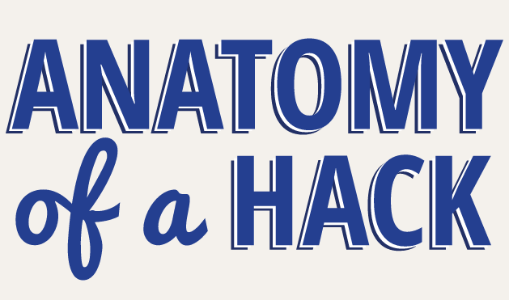

Resume Pertemuan 3 Keamanan Jaringan

 
 
 

 

Latar Belakang Masalah

Semua yang terhubung dengan jaringan tentu tidak ada yang aman, pasti ada celah hacker untuk masuk ke dalam jaringan, hacker mempunyai yang namanya anatomi hacking yang berguna untuk para hacker melakukan hacking.

1. Apa yang dimaksud dengan Anatomi Hacking?
2. Sebutkan dan jelaskan langkah - langkah pada Anatomi Hacking?

Anatomi Hacking adalah langkah – langkah yang dilakukan secara berurutan yang digunakan dalam proses hacking. Selain itu Anatomi Hacking berfungsi untuk bertahan dari serangan – serangan hacker yang menyerang sistem keamanan jaringan kita.

1. Reconnaissance berfungsi untuk melakukan penyelidikan pada sistem dari sebuah jaringan.
2. Scanning berfungsi melakukan pendeteksian dengan detail dari sistem.
3. Gaining Access berfungsi melakukan percobaan masuk ke dalam sistem yang di hack.
4. Maintaining access berfungsi untuk bagaimana supaya tetap bisa masuk dan membuat backdor.
5. Clearing Tracks berfungsi menghapus jejak/log Hacker.

Penutup

Kesimpulan

Dapt disimpulkan bahwa cara untuk melakukan suatu proses hacking atau meretas sebuah jaringan, tentu memiliki teknik atau langkah – langkah yang bisa dilakukan agar dapat berhasil dilakukan dengan baik yaitu dengan Anatomi Hacking

Saran

Saran saya dalam melakukan hacking, kita harus teliti dan jangan lupa menghapus jejak log dan supaya porensi tidak bisa dilacak.

- Nama : Entol Achmad Fikry Ilhamy
- NPM : 1144115
- Kelas : 3C
- Prodi : D4 Teknik Informatika
- Mata Kuliah : Sistem Keamanan Jaringan

Link Github :  [https://github.com/enfikry25/SistemKeamananJaringan](https://github.com/enfikry25/SistemKeamananJaringan)

Referensi :

1. [https://blog.tibandung.com/hacking-anatomy-plus-real-hacking-example/](https://blog.tibandung.com/hacking-anatomy-plus-real-hacking-example/)

Scan Plagiarisme

1. smallseotools - Link  [https://drive.google.com/open?id=0B84lVJ2VqAfRNlVoRkZrbFdNUEk](https://drive.google.com/open?id=0B84lVJ2VqAfRNlVoRkZrbFdNUEk)
2. duplichecker - Link  [https://drive.google.com/open?id=0B84lVJ2VqAfRSmtlWTJVVWpwMDA](https://drive.google.com/open?id=0B84lVJ2VqAfRSmtlWTJVVWpwMDA)