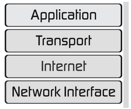

Resume Pertemuan 1 Sistem Keamanan Jaringan

Latar Belakang Masalah

1. Berapa layer yang ada pada OSI Layer?
2. Sebutkan fungsi dari masing – masing layer pada OSI Layer?
3. Berilah contoh pada OSI Layer?
4. Berapa layer yang ada  pada TCP/IP layer?
5. Sebutkan fungsi dari masing – masing layer pada TCP/IP Layer?
6. Berilah contoh pada layer – layer TCP/IP?

Berikut layer pada OSI Layer :

  

- --Applicatiion layer ini berfungsi sebagai user interfaces supaya user dapat melakukan komunikasi dengan layer yang lain nya.
- --Presentation Layer ini berfungsi untuk memastikan proses yang ada pada layer sebelumnya dapat diterjemahkan dari source device.
- --Session Layer ini berfungsi me-maintain dialog antara aplikasi source dan tujuan pada layer lain.
- --Transport Layer ini berfungsi menangani pengiriman data antar komunikasi dan device.
- --Network Layer ini  berfungsi untuk proses pengalamatan secara logika.
- --Data Link Layer ini berfungsi untuk proses pengalamatan secara fisik.
- --Physical Layer ini berfungsi untuk merubah proses atau data yang diterima dari data link layer menjadi bit – bit.

Contoh perangkat atau protokol :

- --Application Layer adalah PC dan Mobile Phone
- --Presentation Layer adalah perangkat lunak director
- --Session Layer adalah NFS atau Network File System
- --Transport Layer adalah TCP atau Connection Oriented
- --Network Layer adalah Router
- --Data Link adalah Bridge dan Switch dan
- --Physical Layer adalah Hub dan kabel Fiber

Berikut ini Layer pada TCP/IP:

  

- --Application Layer ini berfungsi untuk menampilkan data yang komunikasinya melalui jaringan kepada user.
- --Transport Layer ini berfungsi untuk menkonfersidata menjadi paket kecil, kemudian dikirim ke Internet Layer.
- --Internet Layer ini berfungsi untuk mengenkapsulasi paket yang akan dikirim ke Transport Layer dengan alamat logika IP.
- --Network Access layer ini berfungsi untuk mengenkapsulasi alamat logika yang dikirim Internet Layer

Contoh pada layer:

- --Application Layer ada HTTP, Telnet dan FTP.
- --Transport ada TCP dan UDP.
- --Internet Layer ada Address Resolution Protocol.
- --Network Access ada Ethernet dan Public Switched Telephone Network.

Penutup

Kesimpulan

Jadi kesimpulannya bahwa pada ISO Layer dan TCP/IP Layer itu memiliki jumlah layer yg berbeda dan juga ISO Layer merupakan Protocol Independen sedangkan TCP/IP merupakan Protocol Specific

Saran

Saran saya selalu tingkatkan motifasi untuk belajar jaringan, karena jaringan banyak dibutuhkan di luar sana.

- Nama : Entol Achmad Fikry Ilhamy
- NPM : 1144115
- Kelas : 3C
- Prodi : D4 Teknik Informatika
- Mata Kuliah : Sistem Keamanan Jaringan

Link Github :  [https://github.com/enfikry25/SistemKeamananJaringan](https://github.com/enfikry25/SistemKeamananJaringan)

Referensi :  [http://www.diarypc.com/2014/01/pengertian-7-osi-layer-dan-tcpip.html](http://www.diarypc.com/2014/01/pengertian-7-osi-layer-dan-tcpip.html)

Scan Plagiarisme

1. [https://drive.google.com/open?id=0B84lVJ2VqAfRcnpMVTI5QzJRcFE](https://drive.google.com/open?id=0B84lVJ2VqAfRcnpMVTI5QzJRcFE)
2. [https://drive.google.com/open?id=0B84lVJ2VqAfRN2dLWWozUEVtbHc](https://drive.google.com/open?id=0B84lVJ2VqAfRN2dLWWozUEVtbHc)
